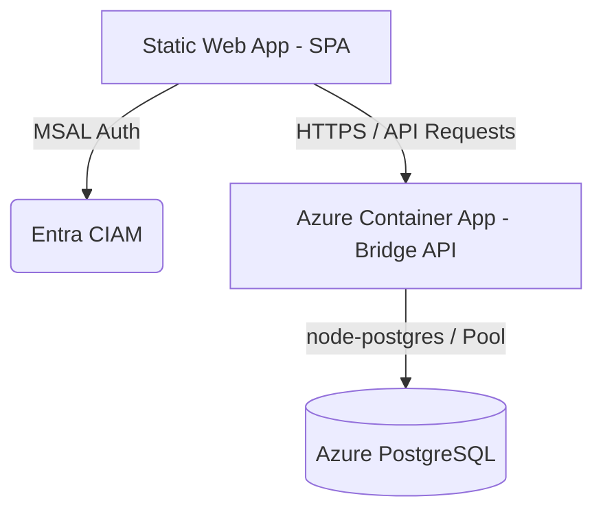

# System Architecture

This document defines the architectural patterns, data flow, and core design principles of the KiddoChecker platform.

## Architectural Pattern

KiddoChecker employs a hybrid architecture combining a **Static SPA Frontend** and a **Containerized Bridge API** connected to a **Managed PostgreSQL Database**.

### Components

1.  **Frontend SPA:** Built with React, Vite, and Shadcn UI. Hosted on Azure Static Web Apps. Handles Kiosk interactions, Parent accounts, and Admin dashboards.
2.  **Bridge API:** Node.js Express server acting as a secure data proxy. Resolves CORS issues, handles PostgreSQL type casting, and routes database requests.
3.  **Database:** Azure PostgreSQL containing schema for Children, Parents, Attendance, Classes, and Security Logs.

## Data Flow & Protocols

### Kiosk Check-In / Check-Out Flow

1.  **Authentication:** Parents or Staff authenticate at the Kiosk terminal.
    *   *Session Persistence:* Parent session details (`localStorage`) automatically restore PIN access upon browser refresh.
2.  **Registration/Check-In:** The UI captures check-in events (e.g., QR scan, PIN input, or Staff override).
3.  **Data Ingestion:** Request is sent to the Bridge API with strict PostgreSQL parameter casting (`::uuid`, `::text`).
4.  **Database Transaction:** Database writes to `attendance` and updates state in real-time.
5.  **Synchronization:** Real-time TanStack queries keep all dashboards synchronized.

### "Bulletproof Filter" Architecture

*   **Goal:** Ensure checked-in children consistently show up for checkout without Parent ID sync loops.
*   **Implementation:** Shifted from Parent-ID joins to a robust `Set`-based frontend filter comparing active database records.

---
*Last updated: 2026-05-16*
