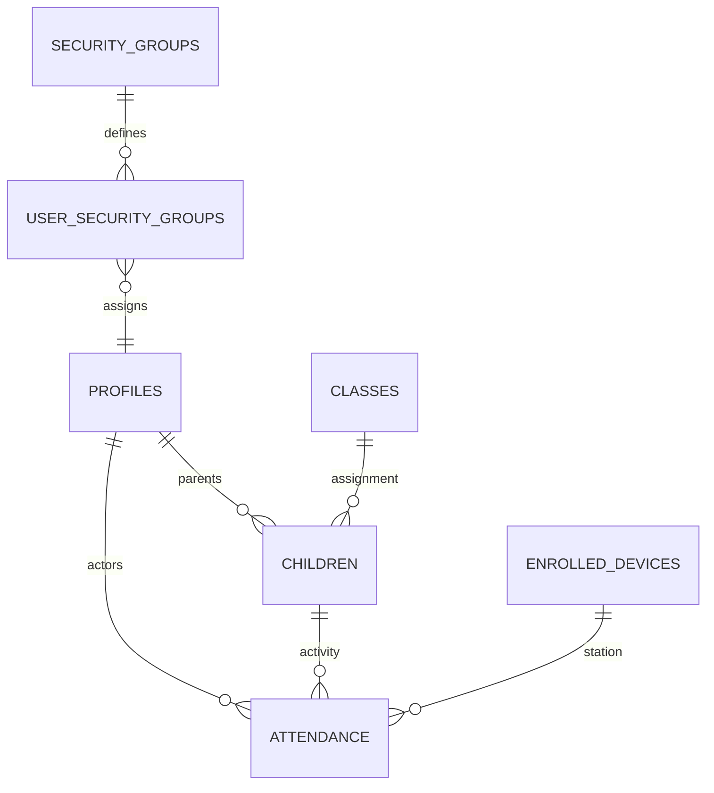

# Database Schema Documentation

## 1. Core Identity & Access Control
KiddoChecker uses a multi-layered identity system combining Supabase Auth with custom role management.

### `profiles`
Central user profiles extending Supabase Auth.
- **id**: `UUID` (Primary Key, references `auth.users`)
- **first_name**: `TEXT`
- **last_name**: `TEXT`
- **email**: `TEXT`
- **phone**: `TEXT`
- **role**: `TEXT` (Legacy role: `admin`, `staff`, `parent`, `teacher`)
- **is_super_admin**: `BOOLEAN`
- **created_at**: `TIMESTAMP`

### `user_roles`
Junction table for granular role assignment.
- **user_id**: `UUID`
- **role**: `TEXT`
- **custom_role_id**: `UUID` (Optional, references `custom_roles`)

### `security_groups`
Additive privilege groups for specific system functions.
- **name**: `TEXT` (e.g., 'Forensic Auditors')
- **description**: `TEXT`

### `user_security_groups`
Links users to additive security groups.
- **user_id**: `UUID`
- **group_id**: `UUID`

---

## 2. Childcare & Attendance
### `children`
Registry of all children in the system.
- **parent_id**: `UUID` (references `profiles`)
- **class_id**: `UUID` (references `classes`)
- **medical_notes**: `TEXT` (Sensitive, access-logged)
- **allergies**: `TEXT`

### `attendance`
Real-time tracking of check-in and check-out events.
- **child_id**: `UUID`
- **checked_in_at**: `TIMESTAMP`
- **checked_out_at**: `TIMESTAMP`
- **checked_in_by**: `UUID` (references `auth.users`)
- **checked_in_method**: `TEXT` ('kiosk', 'qr', 'manual')
- **deviceId**: `UUID` (Mandatory for kiosk-mode)

### `classes`
Classroom definitions.
- **name**: `TEXT`
- **capacity**: `INTEGER`

---

## 3. Hardware & Forensics
### `enrolled_devices`
Inventory of authorized physical hardware.
- **name**: `TEXT`
- **type**: `TEXT` ('kiosk', 'printer')
- **status**: `TEXT` ('active', 'revoked')

### `data_access_logs`
Audit trail for sensitive data interactions.
- **user_id**: `UUID`
- **resource_type**: `TEXT` (e.g., 'medical_notes')
- **accessed_at**: `TIMESTAMP`

### `report_seals`
Cryptographic fingerprints (SHA-256) of generated reports.
- **report_name**: `TEXT`
- **report_hash**: `TEXT`
- **generated_at**: `TIMESTAMP`

---

## 4. Church & CRM Modules
### `ministries` / `departments`
Organization of staff and volunteers.
### `interactions`
CRM tracking for "Guest Journeys" and newcomers.
### `interaction_logs`
Timeline of follow-ups and pastoral care.

---

## 5. Relationships Diagram

